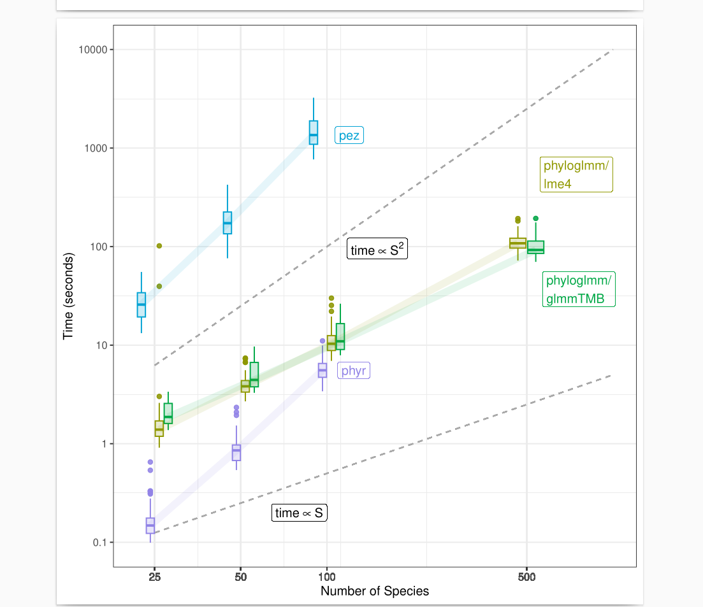

## Miscellaneous

* Space/time complexity/scaling 
   * theory based on operations count etc.
   * constants matter!
* Amdahl's Law
* Space vs time: tradeoffs
* Bottlenecks: computation, I/O, memory access ...
* this topic touches:
   * optimization (what do you do about bottlenecks? vectorize, convert to Rcpp, etc ...)
   * parallelization
   * workflows (use `make`/targets/etc. to avoid re-doing slow parts)

## Benchmarking

* pick appropriate size example (small may be inaccurate, big is annoying)
* `microbenchmark::microbenchmark`, `rbenchmark::benchmark`, `bench::mark`
* Scaling: log-log benchmarking plots (how do results match theoretical values?)

## Profiling

* basic timing: `system.time()` (`proc.time`, `pracma::tic`/`toc`, https://github.com/jabiru/tictoc )
* base R (`Rprof`, `Rprofmem`)
* Noam Ross profile reporting functions: https://www.noamross.net/archives/2013-05-02-improved-r-profiling-summaries/, https://github.com/noamross/noamtools/blob/master/R/proftable.R
* external mem profiling tool: https://github.com/mrc-ide/memprof
* `profvis`
* `aprof`: https://github.com/MarcoDVisser/aprof
* another example with `profvis`: https://csgillespie.github.io/efficientR/performance.html
* https://github.com/bbolker/compstatsR/blob/master/session1.rmd
* Profiling C code: 
    * https://stackoverflow.com/a/60265409/190277
	* https://cran.r-project.org/web/packages/rcpptimer/vignettes/rcpptimer.html
	* https://gallery.rcpp.org/articles/using-the-rcpp-timer/
    * https://gallery.rcpp.org//articles/RcppClock-benchmarking-Rcpp-code/

## References

* https://adv-r.hadley.nz/perf-measure.html
* https://bookdown.org/rdpeng/RProgDA/profiling-and-benchmarking.html

